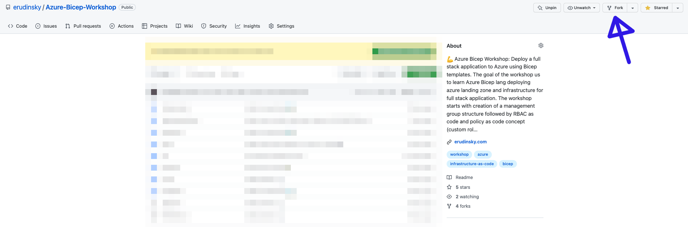

[](https://github.com/erudinsky/Azure-Bicep-Workshop/actions/workflows/azure-bicep-workshop.yml)

## Introduction

Welcome to Azure Bicep workshop. 

Bicep is a domain-specific language (DSL) that uses declarative syntax to deploy Azure resources. In a Bicep file, you define the infrastructure you want to deploy to Azure, and then use that file throughout the development lifecycle to repeatedly deploy your infrastructure. Your resources are deployed in a consistent manner.

We are going to deploy a full stack application to Azure in multiple environments reusing Bicep templates.

**Learning objectives:**

* Infrastructure-as-Code 101
* ARM and Bicep
* Full stack app
* Authoring, best practices
* DevOps

**Prerequisites:**

* Fundamental cloud computing knowledge about Microsoft Azure
* Azure subscription (if you don't have, check how to [get started](https://azure.microsoft.com/free/?wt.mc_id=MVP_387222?))
* [Visual Studio Code (VSC)](https://code.visualstudio.com/?wt.mc_id=MVP_387222?) with [Bicep extension](https://marketplace.visualstudio.com/items?itemName=ms-azuretools.vscode-bicep)
* Azure CLI version 2.71 (or above), [check how install](https://learn.microsoft.com/cli/azure/install-azure-cli?wt.mc_id=MVP_387222?)
* You can also install Bicep CLI manually as described [here](https://learn.microsoft.com/azure/azure-resource-manager/bicep/install?wt.mc_id=MVP_387222#azure-cli), but Azure CLI should be able to do this once you execute command that needs Bicep transpiler

**Prerequisites checks:**

We recommend to follow this workshop using Linux or MacOS terminal, for Windows users it's best to install [WSL](https://learn.microsoft.com/windows/wsl/install?wt.mc_id=MVP_387222?). Open up your VSC and using terminal window check the following:

```bash

# 1. Check version of the Azure CLI
az --version

# 2. Login to Azure Portal
az login

# 3. Create a resource group
az create group -g azure-bicep-worshop-rg -l westeurope

# 4. List resource groups (table output)
az group list -o table

# 5. Delete a resource group
az delete group -g azure-bicep-worshop-rg

```

> Selecting location for the resources you need to keep in mind two things: latency ([this](https://www.azurespeed.com/Azure/Latency) website helps to measure it) and [products available by region](https://azure.microsoft.com/global-infrastructure/services/?wt.mc_id=MVP_387222?).

Make sure all 5 steps from the above give no errors. If you have access to multiple Azure tenants and subscriptions, double check your workspace and set proper subscription so you won't get any surprises: 

```bash

# 1. List subscriptions (table output)
az account list -o table

# 2. Set an account (should be marked "True" in "IsDefault")
az account set -is <SubscriptionId>

```

## Repository

Make sure that you have GitHub account! If you don't please follow [this link](https://github.com/join) to create one. It should take less than a minutes to register. 

Once you have account you need this content. The easiest way to work with it is to fork [this repo](https://github.com/erudinsky/Azure-Bicep-Workshop).



Forked repository can be cloned to your local machine for further changes. You can also propose pull request to the origin repo 🙏

## Workshop

We are going to deploy an infrastructure in Azure for full stack application using Bicep:


You can follow the workshop by checking the following links:

0. [Getting started with Bicep](Workshop/0-Getting-started-with-Bicep.md)
1. [RBAC as code](Workshop/1-RBAC-as-code.md)
2. [Policy as code](Workshop/2-Policy-as-code.md)
3. [Secrets](Workshop/3-Secret-management.md)
4. [Prepare database](Workshop/4-Prepare-database.md)
5. [Server side](Workshop/5-Server-side.md)
6. [Client with vue.js](Workshop/6-Client-with-vuejs.md)
7. [DevOps](Workshop/7-DevOps.md)
8. [Clean up](Workshop/8-Clean-up.md)

Repo structure (pretty much self-explanatory)

```bash

.
├── Labs
│   ├── 1-rbac
│   ├── 2-policies
│   ├── 3-keyvault
│   ├── 4-full-stack
│   ├── 5-server
│   ├── 6-client
│   ├── db
│   ├── modules
│   └── postman
├── README.md <========= this file
└── Workshop
    ├── 0-Getting-started-with-Bicep.md
    ├── 1-RBAC-as-code.md
    ├── 2-Policy-as-code.md
    ├── 3-Secret-management.md
    ├── 4-Prepare-database.md
    ├── 5-Server-side.md
    ├── 6-Client-with-vuejs.md
    ├── 7-DevOps.md
    └── 8-Clean-up.md

```

You can also follow this workshop by watching two videos:

* [Bicep Fundamentals](https://www.youtube.com/watch?v=KgUT1LoFZfk)
* [Deploy a full stack application to Azure using Bicep templates](https://www.youtube.com/watch?v=uOLm15RP5P8)

## Shortcut

In case you can't wait and want to deploy everything in one go, proceed with [template](./templates/).

```bash

templates
├── main.bicep
├── main.init.bicep
├── modules
│   ├── acr.bicep
│   ├── keyvault.bicep
│   ├── postgres.bicep
│   ├── staticsite.bicep
│   └── webapp.bicep
├── parameters.gh.json
└── parameters.init.gh.json

```

1. Generate using az-cli Service Principal: `az ad sp create-for-rbac --name AzureBicepWorkshop --role Owner --scopes / ` and add `AZURE_CREDENTIALS` variable using [this doc](https://github.com/Azure/login?tab=readme-ov-file#login-with-a-service-principal-secret)
2. Add remaining environment variables (secrets) in your project as described [here](https://github.com/erudinsky/Azure-Bicep-Workshop/blob/main/Workshop/7-DevOps.md)
3. Make changes in `parameters.gh.json` and `parameters.init.gh.json`
4. Commit and push changes, GH workload should pickup several pipelines!

## Author

Hi there 👋

I’m Evgeny Rudinsky, a consultant based in The Netherlands and the creator of this workshop. My expertise lies in DevOps, cloud-native technologies, and application security, with a strong focus on Microsoft Azure. I specialize in designing and implementing robust cloud solutions and hold several Azure certifications, including Azure Solution Architect Expert, DevOps Engineer Expert, Azure Security Engineer, Azure Administrator Associate, Azure Developer Associate, and Identity and Access Administrator Associate.

I'm a [Microsoft MVP](https://mvp.microsoft.com/mvp/profile/33cf4dc8-f650-4422-a834-48c08ac92c58) program in 2024 in **Azure Infrastructure as Code** area.

<a href="https://mvp.microsoft.com/mvp/profile/33cf4dc8-f650-4422-a834-48c08ac92c58"></a>

Feel free to follow me on [X (Twitter) @evgenyrudinsky](https://twitter.com/evgenyrudinsky), [LinkedIn](https://www.linkedin.com/in/evgenyrudinsky/) and explore [my blog](https://erudinsky.com/) for insights on DevOps, cloud-native technologies, and application security.

Good luck with the workshop! 🍀
