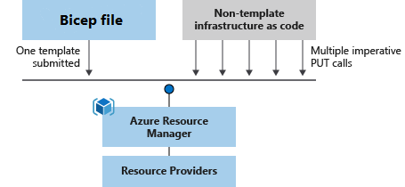

[](https://github.com/erudinsky/Azure-Bicep-Workshop/actions/workflows/azure-bicep-workshop-example.yml)

## Introduction

Welcome to Azure Bicep workshop. 

Bicep is a domain-specific language (DSL) that uses declarative syntax to deploy Azure resources. In a Bicep file, you define the infrastructure you want to deploy to Azure, and then use that file throughout the development lifecycle to repeatedly deploy your infrastructure. Your resources are deployed in a consistent manner.



We are going to deploy a full stack application to Azure in multiple environments reusing Bicep templates.

**Learning objectives:**

* Infrastructure-as-Code 101
* ARM and Bicep
* Full stack app
* Authoring, best practices
* DevOps

**Prerequisites:**

* Fundamental cloud computing knowledge about Microsoft Azure
* Azure subscription (if you don't have, check how to [get started](https://azure.microsoft.com/en-us/free/))
* [Visual Studio Code (VSC)](https://code.visualstudio.com/) with [Bicep extension](https://marketplace.visualstudio.com/items?itemName=ms-azuretools.vscode-bicep)
* Azure CLI version 2.35 (or above), [check how install ](https://docs.microsoft.com/en-us/cli/azure/install-azure-cli)
* You can also install Bicep CLI manually as described [here](https://docs.microsoft.com/en-us/azure/azure-resource-manager/bicep/install#azure-cli), but Azure CLI should be able to do this once you execute command that needs Bicep transpiler

**Prerequisites checks:** 

We recommend to follow this workshop using Linux or MacOS terminal, for Windows users it's best to install [WSL](https://docs.microsoft.com/en-us/windows/wsl/install). Open up your VSC and using terminal window check the following:

```bash

# 1. Check version of the Azure CLI
az --version

# 2. Login to Azure Portal
az login

# 3. Create a resource group
az create group -g azure-bicep-worshop-rg -l westeurope

# 4. List resource groups (table output)
az group list -o table

# 5. Delete a resource group
az delete group -g azure-bicep-worshop-rg

```

> Selecting location for the resources you need to keep in mind two things: latency ([this](https://www.azurespeed.com/Azure/Latency) website helps to measure it) and [products available by region](https://azure.microsoft.com/en-us/global-infrastructure/services/).

Make sure all 5 steps from the above give no errors. If you have access to multiple Azure tenants and subscriptions, double check your workspace and set proper subscription so you won't get any surprises: 

```bash

# 1. List subscriptions (table output)
az account list -o table

# 2. Set an account (should be marked "True" in "IsDefault")
az account set -is <SubscriptionId>

```

## Workshop

1. [Getting started with Bicep](Workshop/1-Getting-started-with-Bicep.md)
2. [Set Azure environment](Workshop/2-Set-Azure-environment.md)
3. [Prepare database](Workshop/3-Prepare-database.md)
4. [Server side](Workshop/4-Server-side.md)
5. [Client with vue.js](Workshop/5-Client-with-vuejs.md)
6. [DevOps](Workshop/6-DevOps.md)
7. [Clean up](Workshop/7-Clean-up.md)

You can also follow this workshop by watching two videos 

* [Bicep Fundamentals](https://www.youtube.com/watch?v=KgUT1LoFZfk)
* [Deploy a full stack application to Azure using Bicep templates](https://www.youtube.com/watch?v=uOLm15RP5P8)

## Author

Hi there 👋

I’m Evgeny Rudinsky, an Cloud Architect based in The Netherlands and author of this workshop. These days most of my work I do with Microsoft Azure and I’m certified Azure Solution Architect Expert, DevOps Engineer Expert, Azure Security Engineer, Azure Administrator Associate, Azure Developer Associate and Identity and Access Administrator Associate.

Follow me on [@evgenyrudinsky](https://twitter.com/evgenyrudinsky) and check [my blog](https://erudinsky.com/) if interested in Cloud Native, Automation and DevSecOps.