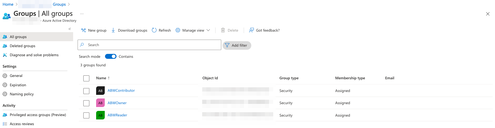
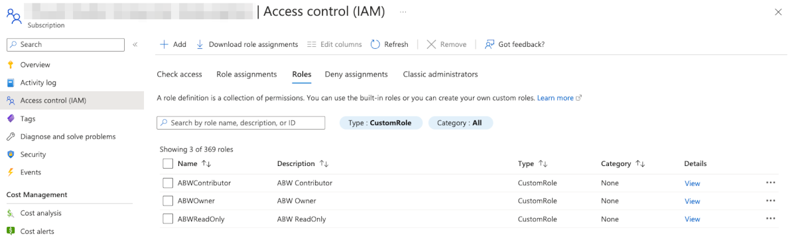
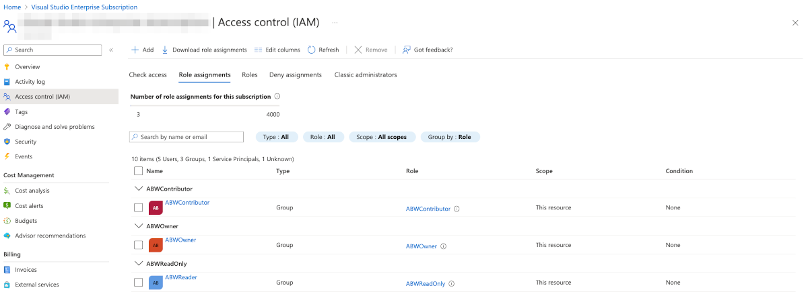

## Introduction 

> NB! This lab requires your identity to have directory role assigned (to keep it simple you'd need [Global Administrator](https://learn.microsoft.com/en-us/azure/active-directory/roles/permissions-reference#global-administrator) role) as you need to create AAD groups and add members to it. If you want to follow [least privileged](https://learn.microsoft.com/en-us/azure/active-directory/roles/delegate-by-task) principal then make sure you have at least [User Administrator](https://learn.microsoft.com/en-us/azure/active-directory/roles/permissions-reference#user-administrator) and [Groups Administrator](https://learn.microsoft.com/en-us/azure/active-directory/roles/permissions-reference#groups-administrator). If you use company's tenant with limited access (no roles) you can skip this lab. Alternatively you can create and use personal tenant for experiment with this lab.

This is the first hands-on lab of this workshop. In this lab we will do the following: 

* Create three security groups in Azure Active Directory. Members of these groups will get access to resources that they are entitled to see / manage;
* Create [custom role](https://learn.microsoft.com/en-us/azure/role-based-access-control/custom-roles) definitions under subscription scope;
* Assign custom roles to relevant security groups under subscription scope.

In a large Azure environment such approach helps to keep properly control on custom role's permissions and manage them at-scale.

## Task 1: create security groups in Azure Active Directory

Using web browser, login to Azure Portal and find Azure Active Directory. Navigate to Manage > Groups. Create three groups with the names: `ABWOwner`, `ABWContributor`, `ABWReader`. Copy object Id of each group, we will use them for assignment later in our template.



## Task 2: create and assign custom roles to security groups

Switch to your terminal (PS, CMD, shell) and change your directory to `./Labs/1-rbac`. This folder contains main template that has references to module `roles.bicep` and custom role definitions `roles` with three json roles. There is also `parameters.json` file that should be used to specify all required parameters.

```bash

Labs
.
├── 1-rbac
│   ├── main.bicep
│   ├── parameters.json
│   └── roles
│       ├── contributor.json
│       ├── owner.json
│       └── reader.json
└── modules
    └── roles.bicep

```

Files in `roles` folder are json role definitions (copy of similar builtin role). Main templates is set to deploy to subscription scope using `targetScope` and it will pick subscription Id from deployment target (`az deployment sub` command will do the magic later). If you use multiple subscriptions make sure `az account list -o table` in your terminal shows `true` under `IsDefault` for the desired target to avoid surprizes (if not, use `az account set -s subscriptionId` to set proper target). Save subscriptionId value as well, you'll need it soon for parameters. You'll also need security group object Ids that you got from Task 1.

Set parameters in `parameters.json` file (make sure to use your owner, contributor and reader values from Task 1). Make sure to replace subscriptionId with your value. 

```json

{
    "$schema": "https://schema.management.azure.com/schemas/2019-04-01/deploymentParameters.json#",
    "contentVersion": "1.0.0.0",
    "parameters": {
        "groups": {
            "value": {
                "owner": "00000000-0000-0000-0000-000000000000",
                "contributor": "00000000-0000-0000-0000-000000000000",
                "reader": "00000000-0000-0000-0000-000000000000"
            }
        },
        "subscriptionId": {
            "value": "00000000-0000-0000-0000-000000000000"
        }
    }
}

```

Let's run the deployment using `az deployment` command in the following way:

```bash

# ‼️ Make sure you are in /Labs/1-rbac folder

# First, let's use validate to check the template and modules:

az deployment sub what-if -f main.bicep -p parameters.json -n ABWRBACDeployment

# Secondly, let's use what-if method to review changes: 

az deployment sub what-if -f main.bicep -p parameters.json -n ABWRBACDeployment

# Thirdly, let's create the actual deployment

az deployment sub create -f main.bicep -p parameters.json -n ABWRBACDeployment


```

The result of the last command should provision the actual resources. Validate them via Azure Portal:




Review bicep module `./modules/roles.bicep` to learn about role definition and role assignment resources. 

Learn about [subscription target scope](https://learn.microsoft.com/en-us/azure/azure-resource-manager/bicep/deploy-to-subscription?tabs=azure-cli), [loops](https://learn.microsoft.com/en-us/azure/azure-resource-manager/bicep/loops) and [modules](https://learn.microsoft.com/en-us/azure/azure-resource-manager/bicep/modules).

## Summary

In chapter we learnt how to provision custom role and assign it to security group. In order to test you can create / invite user to one of the three groups, login with the new user and see what it is able to do and what not (based on membership in group).

Move to the next lab