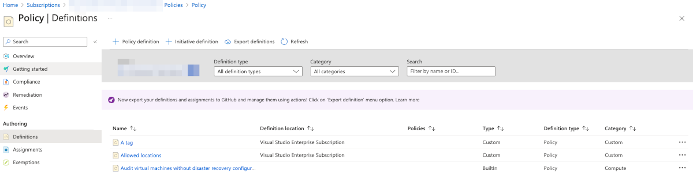
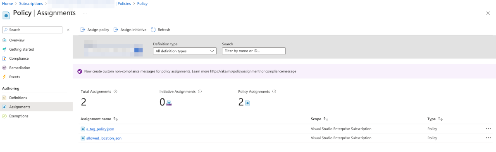
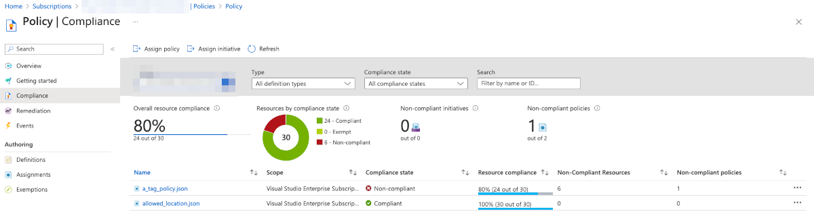

## Lab 2 - Policy as code (optionally)

In this lab we will do the following: 

* Create two policy definitions;
* Assign two policy definitions to subscription scope.

In a large Azure environment such approach helps to keep properly control on policies and manage them at-scale.

## Task 2.1: Create and assign policies to subscription scope

Switch to your terminal (PS, CMD, shell) and change your directory to `./Labs/2-policies`. This folder contains main template that has references to module `policies.bicep` and custom policy definitions in folder `policies` as well as `parameters.json` files to define required parameters:

```bash

.
├── 2-policies
│   ├── main.bicep
│   ├── parameters.json
│   └── policies
│       ├── a_tag_policy.json
│       └── allowed_location.json
└── modules
    └── policies.bicep

```

Files in `policies` folder are json policy definitions. Main templates is set to deploy to subscription scope using `targetScope`. Let's run the deployment using `az deployment` command in the following way:

```bash

# ‼️ Make sure you are in /Labs/1-policies folder

# Validate the template and all references from it

az deployment sub validate -f main.bicep -p parameters.json -n ABWPoliciesDeployment

# Dry-run of the deployment with what-if

az deployment sub what-if -f main.bicep -p parameters.json -n ABWPoliciesDeployment

# Create the actual deployment

az deployment sub create -f main.bicep -p parameters.json -n ABWPoliciesDeployment

```

The result of the last command should provision the actual resources. Validate them via Azure Portal:




Review bicep module `./modules/policies.bicep` to learn about policy definition and policy assignment resources. 

Learn about [subscription target scope](https://learn.microsoft.com/azure/azure-resource-manager/bicep/deploy-to-subscription?tabs=azure-cli&wt.mc_id=MVP_387222?), [loops](https://learn.microsoft.com/azure/azure-resource-manager/bicep/loops?wt.mc_id=MVP_387222?), also expolore other target scope that might be possible to use for this type of resources (for example management group target scope).

## Task 2.2: Find incompliant resources

Now you can check Compliance page to find incompliant resources in your environment. Find out all resources that are not compliant to the new policies (no single tag on resource, deployed not in `swedencentral`, `westeurope`, `eastasia` locations).



## Summary

In this lab we learnt how to create policy and assign it to a specific scope. You also learnt how to use policies for audit.

Move to [Lab 3 - Secrets](3-Secrets.md)