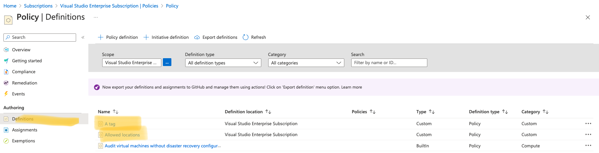
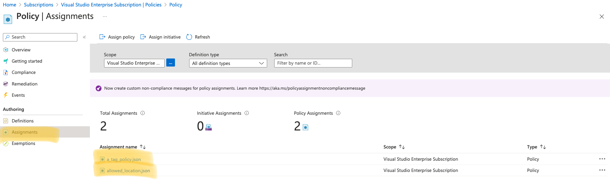

## Introduction 

This is the second hands-on lab of this workshop. In this lab we will do the following: 

* Create two policy definitions;
* Assign two policy definitions to subscription scope.

In a large Azure environment such approach helps to keep properly control on policies and manage them at-scale.

## Task 1: create and assign policies to subscription scope

Switch to your terminal (PS, CMD, shell) and change your directory to `./templates/2-policies`. This folder contains main template that has references to modules and custom policy definitions that we need (like you can see below):

```bash


.
├── main.bicep
├── parameters.json
└── policies
    ├── a_tag_policy.json
    └── allowed_location.json
└── modules
    └── policies.bicep
```

Files in `policies` folder are json policy definitions. Main templates is set to deploy to subscription scope using `targetScope`. Let's run the deployment using `az deployment` command in the following way:

```bash

# ‼️ Make sure you are in /templates/1-policies folder

# Validate the template and all references from it

az deployment sub validate -f main.bicep -p parameters.json -n ABWPoliciesDeployment

# Dry-run of the deployment with what-if

az deployment sub what-if -f main.bicep -p parameters.json -n ABWPoliciesDeployment

# Create the actual deployment

az deployment sub create -f main.bicep -p parameters.json -n ABWPoliciesDeployment

```

The result of the last command should provision the actual resources. Validate them via Azure Portal:




## Summary

In chapter we learnt how to provision custom role and assign it to security group. In order to test you can create / invite user to one of the four groups, login and see what they are able to do and what not.