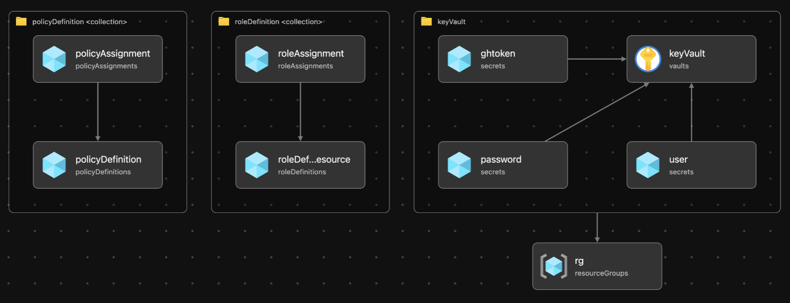
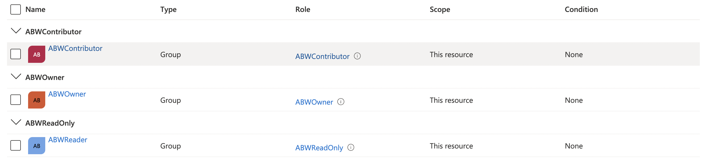
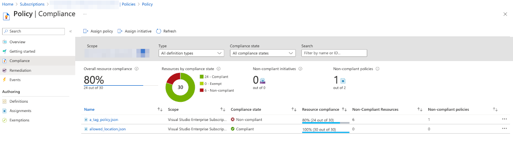
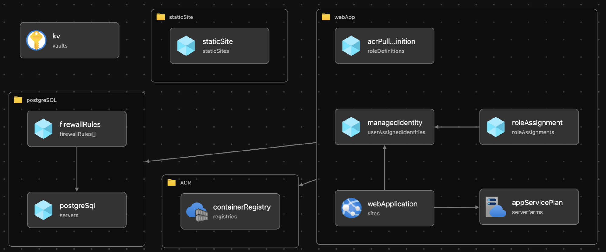

## Azure CLI

Main dependencies:

* [Azure account](https://azure.microsoft.com/en-gb/free/)
* azure-cli 2.35.0 (or above)
* Bicep CLI version 0.5.6 (or above)

Make sure to use proper subscription. Double check listing resource groups.

```bash 

# list logged in accounts

az account list -o table

# set desired account

az account set -s <`subscriptionId` or `subscriptionName`>

# list resource groups

az group list -o table

```

## Deploying custom roles, policies and key vault (with rg)

Let's deploy resource group and some init resources (KV, policies and custom roles) with Bicep to `subscription` targetScope. Review parameters for this deployment: 

```json

{
    "$schema": "https://schema.management.azure.com/schemas/2019-04-01/deploymentParameters.json#",
    "contentVersion": "1.0.0.0",
    "parameters": {
        "resourceGroupName": {
            "value": "azure-bicep-workshop"
        },
        "tags": {
            "value": {
                "purpose": "Azure Bicep Workshop",
                "environment": "dev"
            }
        },
        "tenantId": {
            "value": "<your-tenantId>"
        },
        "objectId": {
            "value": "<your-objectId>"
        },
        "subscriptionId": {
            "value": "<your-subscrptionId>"
        },
        "location": {
            "value": "<your-region>"
        },
        "groups": {
            "value": {
                "owner": "<objectId-of-owner-group>",
                "contributor": "<objectId-of-contributor-group>",
                "reader": "<objectId-of-reader-group>"
            }
        }
    }
}

```

You'll need: 

1. `tenantId` - this is used for access policies in KV
2. `objectId` - this is used for access policies in KV (use your personal identity's objectID to allow your-self manage KV via portal etc)
3. `subscriptionId` - target subscription ID for deployment
4. `location` - region for RG and other resources
5. `groups` - create AAD groups manually and name them *owner*, *contributor* and *reader* and get the objectIds of the groups. Feel free to use portal or CLI.

```bash

tree templates # This is the folder with all templates used in with Workshop

templates
├── main.bicep
├── main.init.bicep
├── modules
│   ├── arc.bicep
│   ├── keyvault.bicep
│   ├── policies.bicep
│   ├── postgres.bicep
│   ├── roles.bicep
│   ├── staticsite.bicep
│   └── webapp.bicep
├── parameters.example.json
├── parameters.init.example.json
├── policies
│   ├── a_tag_policy.json
│   └── allowed_location.json
└── roles
    ├── contributor.json
    ├── owner.json
    └── reader.json

# To deploy roles, policies, RG and KV use the following commands:

az deployment sub validate \
    -f templates/main.init.bicep \
    -p templates/parameters.init.example.json \
    -l eastus2 \
    -resourcePrefix abw

az deployment sub what-if \
    -f templates/main.init.bicep \
    -p templates/parameters.init.example.json \
    -l eastus2 \
    -resourcePrefix abw

az deployment sub create \
    -f templates/main.init.bicep \
    -p templates/parameters.init.example.json \
    -l eastus2 \
    -resourcePrefix abw

```

NB! This step also uses module with Azure KeyVault and add a couple of secrets for communications between parts of our application (server <> db).

You'll be prompted to enter `dbuser` and `dbpassword` and `token` from GH account (for static app deployment) and they'll be stored in Azure KeyVault's secrets. We will consume them from our Server Side App.

At the end of this step you should have the following:

* Three custom role definitions and three role assignments of these roles to subscription scope
* Two custom policies (audit on lacking a tag and audit on allowed locations for resources)
* Resource Group 
* KeyVault with 3 secrets (dbuser, dbpassword and token)

This should be deployed:



Since we have deployed custom roles and assigned them we have Access control (IAM) section changed as well:




Review policies as well. We should now have two policy definitions and assignments created from custom json file. Based on the screenshot below I have everything compliant according to my *allowed_location.json* policy, but there are some incompliant resources according to *a_tag_policy.json* policy (it complains when there is no tag on resource). What is your situation? 



Deployment of management groups, policies and RBAC is one of the fundamental part of Azure Landing Zones. You can learn more about it in this project exploring [high-level deployment flow](https://github.com/Azure/ALZ-Bicep/wiki/DeploymentFlow#high-level-deployment-flow). In this workshop we only cover a little bit of policies and RBAC.


## Deploy the rest of the resources

First review parameters for this deployment: 

```json
{
    "$schema": "https://schema.management.azure.com/schemas/2019-04-01/deploymentParameters.json#",
    "contentVersion": "1.0.0.0",
    "parameters": {
        "resourcePrefix": {
            "value": "abw"
        },
        "location": {
            "value": "westeurope"
        },
        "tags": {
            "value": {
                "purpose": "Azure Bicep Workshop",
                "environment": "dev"
            }
        },
        "acrSku": {
            "value": "Basic"
        },
        "firewallRulesList": {
            "value": [{
                "name": "myip",
                "endIpAddress": "<add_your_IP>",
                "startIpAddress": "<add_your_IP>"
            }]
        },
        "capacity": {
            "value": 1
        },
        "repositoryUrl": {
            "value": "https://github.com/erudinsky/Azure-Bicep-Workshop"
        },
        "branch": {
            "value": "main"
        }
    }
}
```

1. Set `endIpAddress` and `startIpAddress` in `firewallRulesList` with the values of your public IP. You can use any public service if your IP is dynamic and not known or you can also do `curl icanhazip.com` to return the IP via terminal.
2. `repositoryUrl` and `branch` both will be used for static site later. 

```bash 

tree templates # This is the folder with all templates used in with Workshop
templates
├── main.bicep
├── main.init.bicep
├── modules
│   ├── arc.bicep
│   ├── keyvault.bicep
│   ├── policies.bicep
│   ├── postgres.bicep
│   ├── roles.bicep
│   ├── staticsite.bicep
│   └── webapp.bicep
├── parameters.example.json
├── parameters.init.example.json
├── policies
│   ├── a_tag_policy.json
│   └── allowed_location.json
└── roles
    ├── contributor.json
    ├── owner.json
    └── reader.json

# To deploy the rest of the resources use the following command:

az deployment group validate \
    -f templates/main.bicep \
    -p templates/parameters.example.json 

az deployment group what-if \
    -f templates/main.bicep \
    -p templates/parameters.example.json 

az deployment group create \
    -f templates/main.bicep \
    -p templates/parameters.example.json 

```

This step will deploy the following resources: 

* PSQL (FlexibleServer)
* Web App and Service Plan
* Static site
* Managed Identity
* Azure Container Registry



Hope you can see the above then move to the next [task - prepare database](3-Prepare-database.md).