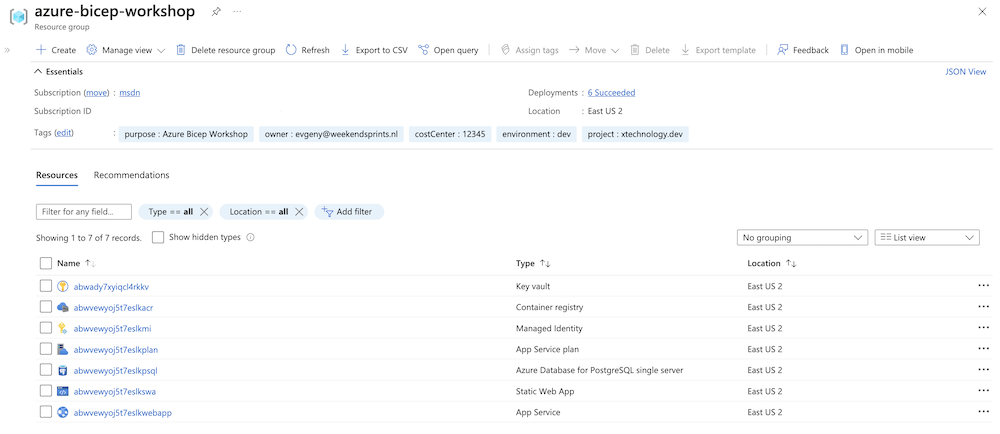

## Azure CLI

Main dependencies:

* [Azure account](https://azure.microsoft.com/en-gb/free/)
* azure-cli 2.35.0 (or above)
* Bicep CLI version 0.5.6 (or above)

Make sure to use proper subscription. Double check listing resource groups.

```bash 

# list logged in accounts

az account list -o table

# set desired account

az account set -s <`subscriptionId` or `subscriptionName`>

# list resource groups

az group list -o table

```

## Deploying resource group and KeyVault with Bicep

Let's deploy resource group and some init resources with Bicep to `subscription` targetScope

```bash

tree templates # This is the folder with all templates used in with Workshop

templates
├── main.bicep
├── main.init.bicep
├── modules
│   ├── arc.bicep
│   ├── keyvault.bicep
│   ├── postgres.bicep
│   ├── staticsite.bicep
│   └── webapp.bicep
├── parameters.init.json
└── parameters.json

# To deploy RG and KV use the following commands:

az deployment sub validate -f templates/main.init.bicep -l eastus2 -resourcePrefix abw
az deployment sub what-if -f templates/main.init.bicep -l eastus2 -resourcePrefix abw
az deployment sub create -f templates/main.init.bicep -l eastus2 -resourcePrefix abw

```

NB! This step also uses module with Azure KeyVault and add a couple of secrets for communications between parts of our application (server <> db).

You'll be prompted to enter `dbuser` and `dbpassword` and `token` from GH account (for static app deployment) and they'll be stored in Azure KeyVault's secrets. We will consume the from our Server Side App.

At the end of this step you should have the following:

* Resource Group 
* KeyVault with 2 secrets (dbuser and dbpassword)

## Deploy the rest of the resources

```bash 

tree templates # This is the folder with all templates used in with Workshop

templates
├── main.bicep
├── main.init.bicep
├── modules
│   ├── arc.bicep
│   ├── keyvault.bicep
│   ├── postgres.bicep
│   ├── staticsite.bicep
│   └── webapp.bicep
├── parameters.init.json
└── parameters.json

# To deploy the rest of the resources use the following command:

az deployment group create -f templates/main.bicep

```

This step will deploy the following resources: 

* PSQL
* Web App and Web App Plan
* Static App
* Managed Identity
* Azure Container Registry



Hope you can see the above then move to the next [task - prepare database](3-Prepare-database.md).