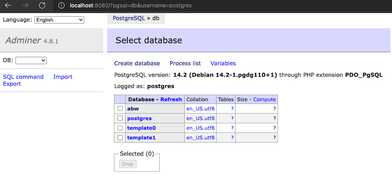
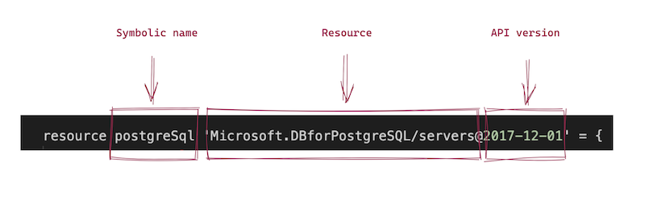

## PosgreSQL for development

Main dependencies:

* Docker runtime (for development environment), [howto install](https://docs.docker.com/desktop/mac/install/)
* PostgreSQL 11
* [PostgreSQL Manamgenet Tool](https://marketplace.visualstudio.com/items?itemName=ckolkman.vscode-postgres)

For development purposes use [PostgreSQL](https://hub.docker.com/_/postgres/). There are multiple ways to run it. 

```bash

docker run -p 5432:5432 -d -e POSTGRES_PASSWORD=secret postgres

psql -h localhost -p 5432 -U postgres # type `secret` for password
\l 
create database mydb;
CREATE DATABASE
\l
\c mydb;
\q

```

Now let's seed some data in it: 

```sql
DROP DATABASE abw_db;
CREATE DATABASE abw_db;
\c abw_db;

DROP TABLE IF EXISTS books;

CREATE TABLE public.books (
    id serial PRIMARY KEY,
    title character varying(150) NOT NULL,
    author character varying(50) NOT NULL,
    pages_num integer NOT NULL,
    read boolean NOT NULL,
    date_added date DEFAULT CURRENT_TIMESTAMP
);

INSERT INTO books (title, author, pages_num, read)
            VALUES ('The Phoenix Projecy','Gene Kim, Kevin Behr and George Spafford',431,True);

INSERT INTO books (title, author, pages_num, read)
            VALUES ('Coders','Clive Thompson',436,False);

INSERT INTO books (title, author, pages_num, read)
            VALUES ('Mindware: Tools for Smart Thinking','Richard E. Nisbett',336,False);
```

Validate either everything has been created succesfully: 

```bash

abw_db=# \c abw_db;
You are now connected to database "abw_db" as user "postgres".
abw_db=# SELECT * FROM books;
 id |               title                |                  author                  | pages_num | read | date_added 
----+------------------------------------+------------------------------------------+-----------+------+------------
  1 | The Phoenix Projecy                | Gene Kim, Kevin Behr and George Spafford |       431 | t    | 2022-04-28
  2 | Coders                             | Clive Thompson                           |       436 | f    | 2022-04-28
  3 | Mindware: Tools for Smart Thinking | Richard E. Nisbett                       |       336 | f    | 2022-04-28
(3 rows)

abw_db=# 

```

PostgreSQL for development environment is complete.

You can also consider docker-compose with web-based GUI adminer tool for the same purposes.

```yaml
# Use postgres/example user/password credentials
version: '3.1'

services:

  db:
    image: postgres
    restart: always
    environment:
      POSTGRES_PASSWORD: secret
    ports:
      - 5432:5432

  adminer:
    image: adminer
    restart: always
    ports:
      - 8080:8080
```

It also has nice web-based client for management: 



## PosgreSQL for production

Main dependencies:

* [Azure account](https://azure.microsoft.com/en-gb/free/)
* azure-cli 2.35.0 (or above)
* Bicep CLI version 0.5.6 (or above)

For production environment we want to use [Azure Database for PostgreSQL](https://azure.microsoft.com/en-us/services/postgresql/), it's fully managed and scalable PostgreSQL.

Learning objectives: 

- [ ] Data types
- [ ] Loops (for)
- [ ] Modules
- [ ] Resource dependencies 

### Data types

* array
* bool
* int
* object
* secureObject - indicated by modifier in Bicep
* secureString - indicated by modifier in Bicep
* string

```

// array

param firewallRulesList array = [
  {
    name: 'myip'
    endIpAddress: '<myip>'
    startIpAddress: '<myip>'
  }
]

// bool
param backup bool = true

// int
param capacity int = 1

// object
param tags object = {
  owner: 'evgeny@weekendsprints.nl'
  costCenter: '12345'
  environment: 'dev'
  purpose: 'workshop'
  project: 'xtechnology.dev'
}

// string
param resourcePrefix string = 'abw'

// secured param (with decorator)

@secure()
param dbuser string
@secure()
param dbpassword string

```

### Decorators

We've have seen `@secure()` decorator for secrets, there are some others

```json

// Description

@description('This is resource prefix for all created resources')
param resourcePrefix string = 'foobar'

// Allowed values

@allowed([
  'Standard_LRS'
  'Standard_GRS'
  'Standard_ZRS'
  'Premium_LRS'
])
param storageSKU string = 'Standard_LRS'

// Others

@maxLength()
@minLength()
@metadata()

```

### Resource dependencies

In Bicep there are two ways working with dependencies: 

* implicit dependency (resources reference or parent/child)
* explicit dependency (dependsOn)

**Implicit** 

```json

resource postgreSql 'Microsoft.DBforPostgreSQL/servers@2017-12-01' = {
  name: postgreSqlName
  location: locationpsql
  tags: tags
  sku: {
    capacity: 1
    family: 'Gen5'
    name: 'B_Gen5_1'
    size: '12288'
    tier: 'Basic'
  }
  identity: {
    type: 'SystemAssigned'
  }
  properties: {
    infrastructureEncryption: 'Disabled'
    sslEnforcement: 'Enabled'
    publicNetworkAccess: 'Enabled'
    storageProfile: {
      backupRetentionDays: 7
      geoRedundantBackup: 'Disabled'
      storageAutogrow: 'Enabled'
      storageMB: 5120
    }
    version: '11'
    createMode: 'Default'
    administratorLogin: administratorLogin
    administratorLoginPassword: administratorLoginPassword
  }
}

resource firewallRules 'Microsoft.DBforPostgreSQL/servers/firewallRules@2017-12-01' = [for firewallRule in firewallRulesList:  {
  name: firewallRule.name
  parent: postgreSql
  properties: {
    endIpAddress: firewallRule.endIpAddress
    startIpAddress: firewallRule.startIpAddress
  }
}]


```

**Explicit**


```json

module keyVault 'modules/keyvault.bicep' = {
  name: 'keyVault'
  params: {
    keyVaultName: keyVaultName
    location: location
    tags: tags
    dbuser: dbuser
    dbpassword: dbpassword
  }
}

resource kv 'Microsoft.KeyVault/vaults@2019-09-01' existing = {
  name: keyVaultName
  scope: resourceGroup(subscriptionId, resourceGroup().name)
}

module postgreSQL 'modules/postgres.bicep' = {
  name: 'postgreSQL'
  dependsOn: [
    keyVault
    kv
  ]
  params: {
    locationpsql: locationpsql
    postgreSqlName: postgreSqlName
    tags: tags
    firewallRulesList: firewallRulesList
    administratorLogin: kv.getSecret('dbuser')
    administratorLoginPassword: kv.getSecret('dbpassword')
  }
}


```

### Functions

Examples of functions: 

```json

// Current time / date (formatting available), https://docs.microsoft.com/en-us/azure/azure-resource-manager/bicep/bicep-functions
param timeNow string = '${utcNow()}-firewallrule'

// Uniq string (13) for resource name generator
param acrName string = '${resourcePrefix}${uniqueString(location)}acr'

// Inherit location from RG
param location string = resourceGroup().location

// getSecret from KV
administratorLogin: kv.getSecret('dbuser')

```

### Provision of Azure PostgreSQL using Bicep

Azure DB for PostgreSQL has been provisioned already as part of the main deployment, let's review the template:

```bicep

// main.bicep

param postgreSqlName string = '${resourcePrefix}${uniqueString(location)}psql'
param firewallRulesList array = [
  {
    name: 'myip'
    endIpAddress: 'my_ip'
    startIpAddress: 'my_ip'
  }
]
param capacity int = 1


module postgreSQL 'modules/postgres.bicep' = {
  name: 'postgreSQL'
  dependsOn: [
    keyVault
    kv
  ]
  params: {
    locationpsql: locationpsql
    capacity: capacity
    postgreSqlName: postgreSqlName
    tags: tags
    firewallRulesList: firewallRulesList
    administratorLogin: kv.getSecret('dbuser')
    administratorLoginPassword: kv.getSecret('dbpassword')
  }
}

// modules/postres.bicep

param postgreSqlName string
param locationpsql string
param tags object
param firewallRulesList array
@secure()
param administratorLogin string
@secure()
param administratorLoginPassword string
param capacity int

resource postgreSql 'Microsoft.DBforPostgreSQL/servers@2017-12-01' = {
  name: postgreSqlName
  location: locationpsql
  tags: tags
  sku: {
    capacity: capacity
    family: 'Gen5'
    name: 'B_Gen5_1'
    size: '12288'
    tier: 'Basic'
  }
  identity: {
    type: 'SystemAssigned'
  }
  properties: {
    infrastructureEncryption: 'Disabled'
    sslEnforcement: 'Enabled'
    publicNetworkAccess: 'Enabled'
    storageProfile: {
      backupRetentionDays: 7
      geoRedundantBackup: 'Disabled'
      storageAutogrow: 'Enabled'
      storageMB: 5120
    }
    version: '11'
    createMode: 'Default'
    administratorLogin: administratorLogin
    administratorLoginPassword: administratorLoginPassword
  }
}

resource firewallRules 'Microsoft.DBforPostgreSQL/servers/firewallRules@2017-12-01' = [for firewallRule in firewallRulesList:  {
  name: firewallRule.name
  parent: postgreSql
  properties: {
    endIpAddress: firewallRule.endIpAddress
    startIpAddress: firewallRule.startIpAddress
  }
}]

```



To get all available resources and it's paramenters along with API verions, keep this page at hand: https://docs.microsoft.com/en-us/azure/templates/

`firewallRulesList` is an array with allowed IP (to fetch my ip I used `curl icanhazip.com`).

```bash

../templates
├── main.bicep <--- 
├── main.rg.bicep
├── modules
│   ├── arc.bicep
│   ├── keyvault.bicep <--- 
│   └── postgres.bicep <--- 
├── parameters.dev.json
└── parameters.prod.json <---

```

### Test deployed PSQL

```bash

psql sslmode=require -h <host> -U <user> --password <password> -d postgres

\l
create database mydb;
\c mydb
\l
\q

```

Now let's seed some data in it: 

```sql
DROP DATABASE abw_db;
CREATE DATABASE abw_db;
\c abw_db;

DROP TABLE IF EXISTS books;

CREATE TABLE public.books (
    id serial PRIMARY KEY,
    title character varying(150) NOT NULL,
    author character varying(50) NOT NULL,
    pages_num integer NOT NULL,
    read boolean NOT NULL,
    date_added date DEFAULT CURRENT_TIMESTAMP
);

INSERT INTO books (title, author, pages_num, read)
            VALUES ('The Phoenix Projecy','Gene Kim, Kevin Behr and George Spafford',431,True);

INSERT INTO books (title, author, pages_num, read)
            VALUES ('Coders','Clive Thompson',436,False);

INSERT INTO books (title, author, pages_num, read)
            VALUES ('Mindware: Tools for Smart Thinking','Richard E. Nisbett',336,False);
```

Validate either everything has been created succesfully: 

```bash

abw_db=# \c abw_db;
You are now connected to database "abw_db" as user "postgres".
abw_db=# SELECT * FROM books;
 id |               title                |                  author                  | pages_num | read | date_added 
----+------------------------------------+------------------------------------------+-----------+------+------------
  1 | The Phoenix Projecy                | Gene Kim, Kevin Behr and George Spafford |       431 | t    | 2022-04-28
  2 | Coders                             | Clive Thompson                           |       436 | f    | 2022-04-28
  3 | Mindware: Tools for Smart Thinking | Richard E. Nisbett                       |       336 | f    | 2022-04-28
(3 rows)

abw_db=# 

```

PostgreSQL for production environment is complete.

## Back and Restore

While in Azure's environment you can configure automatic backup and restore your DB it worth to mention the following steps for manual backup / restore operations

```bash

# dump db to file

pg_dump -h localhost -U postgres abw_db > abw_db.sql

# restore db from file

psql sslmode=<mode> -h <host> -U <user> -f abw_db.sql postgres -d postgres

# sslmode can be either require or prefer

```

Move to the next [task - server side](4-Server-side.md).
