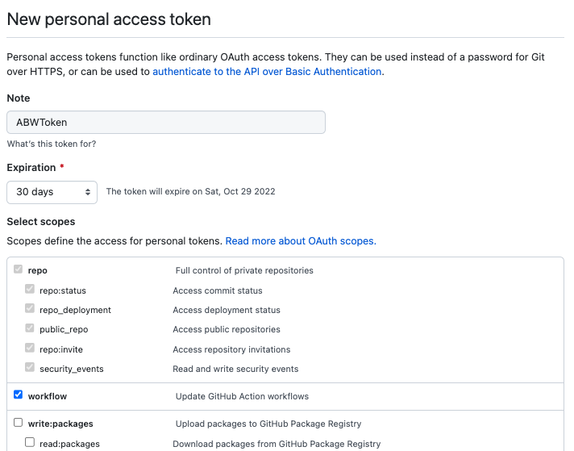
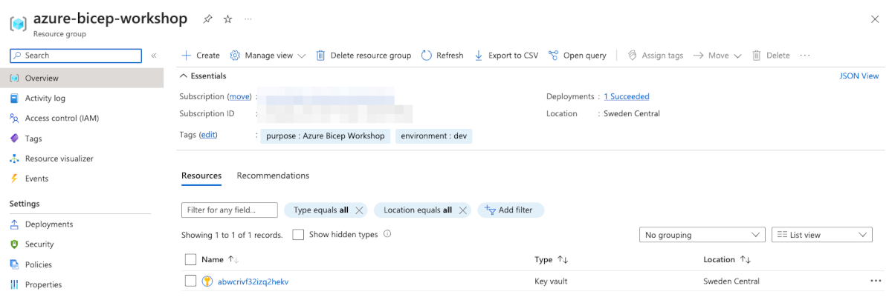

## Lab 3 - KeyVault and secrets

This is the third hands-on lab of this workshop. In this lab we will do the following: 

* Create Azure Key Vault;
* Create three secrets.

[Azure Key Vault](https://learn.microsoft.com/en-us/azure/key-vault/general/basic-concepts) is a cloud service for securely storing and accessing secrets. A secret is anything that you want to tightly control access to, such as API keys, passwords, certificates, or cryptographic keys. Key Vault service supports two types of containers: vaults and managed hardware security module(HSM) pools. Vaults support storing software and HSM-backed keys, secrets, and certificates. Managed HSM pools only support HSM-backed keys. See Azure Key Vault REST API overview for complete details.

We will provision three secrets: `dbuser`, `dbpassword` for our future PostgreSQL DB and `token` that will be used by Static Site service to create workflow (GitHub actions) in order to deploy vuejs changes (this will be explained in [Lab 6](6-Client-with-vuejs.md), don't worry for now).


## Task 3.1: Prepare secrets

The password of the administrator `dbpassword` - minimum 8 characters and maximum 128 characters. Password must contain characters from three of the following categories: English uppercase letters, English lowercase letters, numbers, and non-alphanumeric characters ([source](https://learn.microsoft.com/en-us/cli/azure/postgres/server?view=azure-cli-latest#az-postgres-server-create-optional-parameters)).

`dbuser` can be any string

`token` should be generated via GitHub, follow [this instruction](https://docs.github.com/en/enterprise-server@3.4/authentication/keeping-your-account-and-data-secure/creating-a-personal-access-token). Make sure that you pick all permissions in `repo` and `workflow` like on the screenshot below:



Store somewhere temporary the token.

## Task 3.2: Deployment of resource group and Key Vault with secrets

Let's deploy resource group and key vault with secrets. Switch to your terminal (PS, CMD, shell) and change your directory to `./Labs/3-secrets`. This folder contains main template that has references to module `keyvault.bicep`. There is also `parameters.json` file that should be used to specify all required parameters.

```bash

.
├── 3-keyvault
│   ├── main.bicep
│   └── parameters.json
└── modules
    └── keyvault.bicep

```

Let's review parameters: 


```json

{
    "$schema": "https://schema.management.azure.com/schemas/2019-04-01/deploymentParameters.json#",
    "contentVersion": "1.0.0.0",
    "parameters": {
        "resourceGroupName": {
            "value": "azure-bicep-workshop"
        },
        "tags": {
            "value": {
                "purpose": "Azure Bicep Workshop",
                "environment": "dev"
            }
        },
        "tenantId": {
            "value": "00000000-0000-0000-0000-000000000000" 
        },
        "objectId": {
            "value": "00000000-0000-0000-0000-000000000000"
        },
        "location": {
            "value": "swedencentral"
        }
    }
}

```

Let's find out `objectId` and `tenantId`:

1. `az account list -o table` should output `tenantId`;
2. You can find `objectId` of you user in the portal Azure Active Directory > Users > <find yourself> > Overview.

Let's deploy it:

```bash

# ‼️ Make sure you are in /Labs/3-secrets folder

# Validate the template and all references from it

az deployment sub validate -f main.bicep -p parameters.json -n ABWSecretsDeployment

# Dry-run of the deployment with what-if

az deployment sub what-if -f main.bicep -p parameters.json -n ABWSecretsDeployment

# Create the actual deployment

az deployment sub create -f main.bicep -p parameters.json -n ABWSecretsDeployment

```

> NB! This step also uses module with Azure KeyVault and add a couple of secrets for communications between parts of our application (server <> db).

You'll be prompted to enter `dbuser` and `dbpassword` and `token` from GH account (for static app deployment) and they'll be stored in Azure KeyVault's secrets. We will consume them from our Server Side App and Static Site services.

At the end of this step you should have the following:

* Resource Group 
* KeyVault with 3 secrets (dbuser, dbpassword and token)

Let's review deployed resources: 




Learn about [secure parameters](https://learn.microsoft.com/en-us/azure/azure-resource-manager/bicep/parameters#secure-parameters) and parameters in general. We used secure parameters for dbuser, password and token. Learn how to deploy resources to [another target scope](https://learn.microsoft.com/en-us/azure/azure-resource-manager/bicep/deploy-to-resource-group?tabs=azure-cli#scope-to-different-resource-group) using modules.

## Summary

In this lab we learnt how to create resource group and key vault with secrets.

Move to [Lab 4 - Prepare database](4-Prepare-database.md)