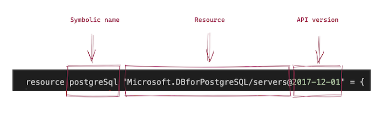

## Introduction

This is the fourth hands-on lab of this workshop and in includes several modules. In this module we will look into database. 

## Task 4.1: PosgreSQL for development (optionally)

The intention of this task is to learn how to work with SQL (postgres) running it on local machine. If you are familiar with PSQL and how to: create user, database and seed data, feel free to skip and move to Task 4.2.

Main dependencies:

* Docker runtime (for development environment), [howto install](https://docs.docker.com/desktop/mac/install/)
* PostgreSQL 11
* [PostgreSQL Manamgenet Tool](https://marketplace.visualstudio.com/items?itemName=ckolkman.vscode-postgres)

For development purposes use [PostgreSQL](https://hub.docker.com/_/postgres/). There are multiple ways to run it. 

```bash

docker run -p 5432:5432 -d -e POSTGRES_PASSWORD=secret postgres

psql -h localhost -p 5432 -U postgres # type `secret` for password
\l 
create database mydb;
CREATE DATABASE
\l
\c mydb;
\q

```

Now let's seed some data in it: 

```sql
DROP DATABASE abw_db;
CREATE DATABASE abw_db;
\c abw_db;

DROP TABLE IF EXISTS books;

CREATE TABLE public.books (
    id serial PRIMARY KEY,
    title character varying(150) NOT NULL,
    author character varying(50) NOT NULL,
    pages_num integer NOT NULL,
    read boolean NOT NULL,
    date_added date DEFAULT CURRENT_TIMESTAMP
);

INSERT INTO books (title, author, pages_num, read)
            VALUES ('The Phoenix Projecy','Gene Kim, Kevin Behr and George Spafford',431,True);

INSERT INTO books (title, author, pages_num, read)
            VALUES ('Coders','Clive Thompson',436,False);

INSERT INTO books (title, author, pages_num, read)
            VALUES ('Mindware: Tools for Smart Thinking','Richard E. Nisbett',336,False);
```

Validate either everything has been created succesfully: 

```bash

abw_db=# \c abw_db;
You are now connected to database "abw_db" as user "postgres".
abw_db=# SELECT * FROM books;
 id |               title                |                  author                  | pages_num | read | date_added 
----+------------------------------------+------------------------------------------+-----------+------+------------
  1 | The Phoenix Projecy                | Gene Kim, Kevin Behr and George Spafford |       431 | t    | 2022-04-28
  2 | Coders                             | Clive Thompson                           |       436 | f    | 2022-04-28
  3 | Mindware: Tools for Smart Thinking | Richard E. Nisbett                       |       336 | f    | 2022-04-28
(3 rows)

abw_db=# 

```

PostgreSQL for development environment is complete.


## Task 4.2: Review and change parameters for DB

Open up parameters file in `./Labs/4-full-stack` folder:

```json

{
    "$schema": "https://schema.management.azure.com/schemas/2019-04-01/deploymentParameters.json#",
    "contentVersion": "1.0.0.0",
    "parameters": {
        "resourcePrefix": {
            "value": "abw"
        },
        "location": {
            "value": "eastasia"
        },
        "tags": {
            "value": {
                "purpose": "Azure Bicep Workshop",
                "environment": "dev"
            }
        },
        "acrSku": {
            "value": "Basic"
        },
        "firewallRulesList": {
            "value": [{
                "name": "myip",
                "endIpAddress": "0.0.0.0",
                "startIpAddress": "0.0.0.0"
            },
            {
                "name": "azure_services",
                "endIpAddress": "0.0.0.0",
                "startIpAddress": "0.0.0.0"
            }]
        },
        "capacity": {
            "value": 1
        },
        "repositoryUrl": {
            "value": "https://github.com/erudinsky/Azure-Bicep-Workshop"
        },
        "branch": {
            "value": "main"
        }
    }
}

```

1. Set `endIpAddress` and `startIpAddress` in `firewallRulesList` with the values of your public IP. You can use any public service if your IP is dynamic and not known or you can also do `curl icanhazip.com` to return the IP via terminal (or search in bing/google "my ip").
2. `repositoryUrl` and `branch` both will be used for static site later. Repository's URL is the one that you forked!
3. Since Static Site service available in limited number of regions (2022, September), we use `eastasia`.

```bash 

.
├── 4-full-stack
│   ├── main.bicep
│   └── parameters.json
└── modules
    └── postgres.bicep

```

## Task 4.3: PosgreSQL for production

The intention of this task is to provision infrastructure for PostgreSQL using Bicep template.

Main dependencies:

* [Azure account](https://azure.microsoft.com/en-gb/free/)
* azure-cli 2.35.0 (or above)
* Bicep CLI version 0.5.6 (or above)

For production environment we want to use [Azure Database for PostgreSQL](https://azure.microsoft.com/en-us/services/postgresql/), it's fully managed and scalable PostgreSQL.

Let's review the module `postgres.bicep` in modules folder. In contains `Microsoft.DBforPostgreSQL/servers` and `Microsoft.DBforPostgreSQL/servers/firewallRules` as it's [child](https://learn.microsoft.com/en-us/azure/azure-resource-manager/bicep/child-resource-name-type). We also use [getSecret](https://learn.microsoft.com/en-us/azure/azure-resource-manager/bicep/bicep-functions-resource#getsecret) function to query Key Vault directly from bicep to get values of our dbuser and password.

Bicep's provider/resource has the following structure:



To get all available resources and it's paramenters along with API verions, keep this page at hand: https://docs.microsoft.com/en-us/azure/templates/

## Task 4.4: Deploy entire full stack

In this task we want to make sure we have all required parameters in `parameters.json` file in `./Labs/4-full-stack` folder. 

```json

{
    "$schema": "https://schema.management.azure.com/schemas/2019-04-01/deploymentParameters.json#",
    "contentVersion": "1.0.0.0",
    "parameters": {
        "resourcePrefix": {
            "value": "abw"
        },
        "location": {
            "value": "eastasia"
        },
        "tags": {
            "value": {
                "purpose": "Azure Bicep Workshop",
                "environment": "dev"
            }
        },
        "acrSku": {
            "value": "Basic"
        },
        "firewallRulesList": {
            "value": [{
                "name": "myip",
                "endIpAddress": "0.0.0.0",
                "startIpAddress": "0.0.0.0"
            },
            {
                "name": "azure_services",
                "endIpAddress": "0.0.0.0",
                "startIpAddress": "0.0.0.0"
            }]
        },
        "capacity": {
            "value": 1
        },
        "repositoryUrl": {
            "value": "https://github.com/erudinsky/Azure-Bicep-Workshop"
        },
        "branch": {
            "value": "main"
        }
    }
}

```

You'll need the name of the KeyVault (the one that you deployd in [Lab 3](3-Secrets.md)). It should be generated with uniqueString and it's value should be something like this `abwcrivf32izq2hekv`

Feel free to change `location`, `acrSku`, add / change / remove `tags`. Once done, let's deploy entire application by doing the following: 

```bash

# ‼️ Make sure you are in /Labs/4-full-stack folder

# Validate the template and all references from it

az deployment group validate -g azure-bicep-workshop -f main.bicep -p parameters.json keyVaultName=<replace-with-yours> -n ABWFullStackDeployment

# Dry-run of the deployment with what-if

az deployment group what-if -g azure-bicep-workshop -f main.bicep -p parameters.json keyVaultName=<replace-with-yours> -n ABWFullStackDeployment

# Create the actual deployment

az deployment group create -g azure-bicep-workshop -f main.bicep -p parameters.json keyVaultName=<replace-with-yours> -n ABWFullStackDeployment

```

Review result in Azure Portal: 


### Task 4.4: Work with deployed database

In this task we will connect to remote database server, create database and structure and seed some data.

```bash

psql sslmode=require -h <servername> -U <user@hostname> -d postgres

\l
create database abw_db;
\c abw_db
\l
\q

```

You can see `servername` and `user@hostname` in the portal like this: 


Your password should be in the Key Vault (in case you forgot it).

Now let's seed some data in it: 

```sql

CREATE DATABASE abw_db;
\c abw_db;

DROP TABLE IF EXISTS books;

CREATE TABLE public.books (
    id serial PRIMARY KEY,
    title character varying(150) NOT NULL,
    author character varying(50) NOT NULL,
    pages_num integer NOT NULL,
    read boolean NOT NULL,
    date_added date DEFAULT CURRENT_TIMESTAMP
);

INSERT INTO books (title, author, pages_num, read)
            VALUES ('The Phoenix Projecy','Gene Kim, Kevin Behr and George Spafford',431,True);

INSERT INTO books (title, author, pages_num, read)
            VALUES ('Coders','Clive Thompson',436,False);

INSERT INTO books (title, author, pages_num, read)
            VALUES ('Mindware: Tools for Smart Thinking','Richard E. Nisbett',336,False);
```

Validate either everything has been created succesfully: 

```bash

abw_db=# \c abw_db;
You are now connected to database "abw_db" as user "postgres".
abw_db=# SELECT * FROM books;
 id |               title                |                  author                  | pages_num | read | date_added 
----+------------------------------------+------------------------------------------+-----------+------+------------
  1 | The Phoenix Projecy                | Gene Kim, Kevin Behr and George Spafford |       431 | t    | 2022-04-28
  2 | Coders                             | Clive Thompson                           |       436 | f    | 2022-04-28
  3 | Mindware: Tools for Smart Thinking | Richard E. Nisbett                       |       336 | f    | 2022-04-28
(3 rows)

abw_db=# 

```

PostgreSQL for production environment is complete.

## Task 4.5: Backup and Restore (Optionally)

While in Azure's environment you can configure automatic backup and restore your DB it worth to mention the following steps for manual backup / restore operations

```bash

# dump db to file

pg_dump -h localhost -U postgres abw_db > abw_db.sql

# restore db from file

psql sslmode=<mode> -h <host> -U <user> -f abw_db.sql postgres -d postgres

# sslmode can be either require or prefer

```

## Summary

In this lab we learnt how to create full stack application's infra 😀 and configured SQL. In the nest modules we will explore the rest of templates that we used for the app.

* PostgreSQL
* Web App and Service Plan
* Static Site
* Container Registry for Image
* Managed Identity that is used by Web App for pulling image from ACR

Move to the [Server side](5-Server-side.md).