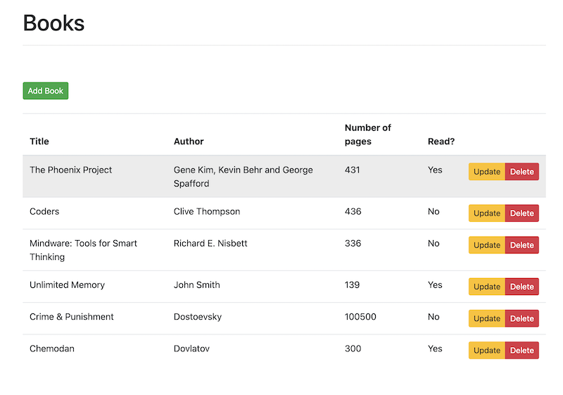

## Static Site

To host our client's part (vue.js) we want to use [Static Web Apps](https://azure.microsoft.com/en-us/services/app-service/static/#overview). Static Site Web Application resource has been provisioned as part of the main deployment, let's review it's template.

```json 

// 7. StaticSite

param staticSiteName string = '${resourcePrefix}${uniqueString(location)}swa'
param repositoryUrl string
param branch string

module staticSite 'modules/staticsite.bicep' = {
  name: 'staticSite'
  params: {
    staticSiteName: staticSiteName
    location: location
    tags: tags
    repositoryToken: kv.getSecret('token')
    repositoryUrl: repositoryUrl
    branch: branch
  }
}


// modules/staticsite.bicep

param staticSiteName string
param location string
param tags object
@secure()
param repositoryToken string
param repositoryUrl string
param branch string

resource staticSite 'Microsoft.Web/staticSites@2021-03-01' = {
  name: staticSiteName
  location: location
  tags: tags
  sku: {
    name: 'free'
    tier: 'free'
  }
  properties: {
    repositoryUrl: repositoryUrl
    branch: branch
    stagingEnvironmentPolicy: 'Enabled'
    allowConfigFileUpdates: true
    provider: 'GitHub'
    enterpriseGradeCdnStatus: 'Disabled'
    repositoryToken: repositoryToken
    buildProperties: {
      appLocation: 'client'
      appArtifactLocation: 'dist'
    }
  }
}

```

To learn more about Static Site resource and it's available parameters visit [template reference](https://docs.microsoft.com/en-us/azure/templates/microsoft.web/staticsites?tabs=bicep).

## Application

Main dependencies:

* [Vuejs](https://vuejs.org/) 
* [Vue CLI](https://cli.vuejs.org/)

```bash 

tree client

client
├── babel.config.js
├── dist
├── node_modules
├── package-lock.json
├── package.json
├── public
├── src
    ├── App.vue
    ├── assets
    │   └── logo.png
    ├── components
    │   ├── Alert.vue
    │   ├── Books.vue
    │   ├── HelloWorld.vue
    │   └── Ping.vue
    ├── main.js
    └── router
        └── index.js
└── vue.config.js

npm run serve # to test application

```

If everything went well you should be able to see the following.



## Resources

* [vuejs getting started](https://v1.vuejs.org/guide/)
* [Template reference (Static Web)](https://docs.microsoft.com/en-us/azure/templates/microsoft.web/staticsites?tabs=bicep)