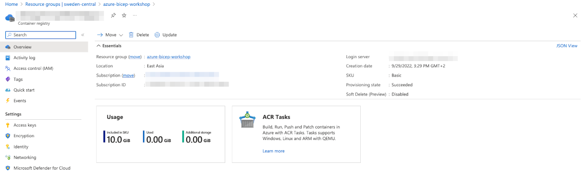
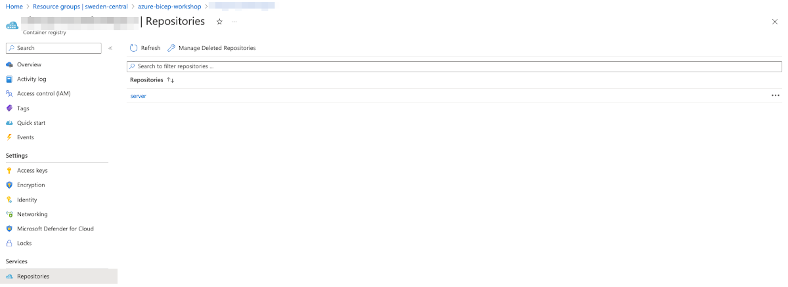

## Lab 5 - Server Side configuration

In this lab we will look into server side part.

## Task 5.1: Work with application locally (optionally)

Main dependencies:

* Python 3.10.2
* [flask](https://flask.palletsprojects.com/en/2.1.x/)
* pip for package management

Virtual environments enable you to have an isolated space on your computer for Python projects, ensuring that each of your projects can have its own set of dependencies that won’t disrupt any of your other projects.

```bash

5-server
├── Dockerfile
├── app.py
├── requirements.txt
└── seed.py

python3 -m venv env
source env/bin/activate
pip install -r requirements.txt
python3 app.py

```

Application uses 

`flask_cors` for CORS support (allows call application's routes from another domain since vuejs will live in a separate server).
`psycopg2` - postgreSQL client

make sure to have the following environment variables, otherwise set them up (development):

```bash
 
export POSTGRES_USER=postgres
export POSTGRES_PORT=5432
export POSTGRES_PASSWORD=secret
export POSTGRES_HOST=localhost
export POSTGRES_NAME=abw_db
export POSTGRES_SSLMODE=prefer

env | grep POSTGRES # to make sure they've set up succesfully

 ```

> For Production `POSTGRES_SSLMODE` should be set to `require`. Read about SSL Mode Descriptions [here](https://www.postgresql.org/docs/9.1/libpq-ssl.html)


Validate if the application runs with `flask run`, type in browser the following: 

* http://localhost:5000/health <--- should respond with `"I am fine!"`
* http://localhost:5000/books <--- should return json with several boosk (we've added as seeds earlier)

Stop running application with `CTRL+C`.

## Task 5.2: Dockerize

Work in the folder `./Labs/5-server` that has the following content:

```bash 

5-server
├── Dockerfile
├── app.py
├── requirements.txt
└── seed.py

```

Review `Dockerfile`, build, tag and push image to ACR.

```Dockerfile
FROM python:latest
WORKDIR /app
COPY requirements.txt requirements.txt
RUN pip3 install -r requirements.txt
COPY app.py app.py
COPY seed.py seed.py
CMD [ "python", "app.py"]
```

To get the name of your ACR:



```bash

# Get a list of all ACR in the account (mainly to get the name of the ACR)

az acr list -o table

# Login to ACR

az acr login -n <acrname>
Login Succeeded

# build with tag and push

docker build -t <your_acr>.azurecr.io/server .
docker push <your_acr>.azurecr.io/server

# Run dockerized application (-p 5000:5000 maps container's port to host's port so I can access)

docker run -p 5000:5000 <your_acr>.azurecr.io/server

```

> For Mac users with M1/M2 chipsets you'll need to use buildx for building image locally ([more information](https://docs.docker.com/build/building/multi-platform/)). Example of such build would be:

```bash

# change directory to ./Labs/5-server

docker buildx build --platform linux/amd64 -t <acrName>.azurecr.io/server .
docker push <acrName>.azurecr.io/server

```

Validate that your image has been pushed to ACR by going to Azure Portal > Azure Container Registry > Repositories:



## Task 5.3: Web App with Bicep

To host our flask application in production let's use Web App (PaaS service that gives 99.99% SLA and is easy to scale and maintain). The Web App as well as it's App Service Plan, Managed Identiy and ACR have been provisioned as part of the main deployment, let's review it's template:

In the [Lab 4](4-Prepare-database.md) we deployed several resources that we use for our backend:

* Web App and Service Plan
* Managed Identity
* Container Registry

We just used Container Registry in Task 5.2 for our backend application. Now review module `./Labs/modules/webapp.bicep` and pay attention to the following: 

1. Web App has references to PSQL via outputs (most of the references are used for authentication with DB);
2. Managed Identity is used for pull image from ACR (otherwise it won't authorize). Check attributes `acrUseManagedIdentityCreds` and `acrUserManagedIdentityID`.
3. We also use roleAssignment resource to assign acrPull [builtin](https://docs.microsoft.com/en-us/azure/role-based-access-control/built-in-roles) role to ACR, so our Web App can pull succesfully.

> There are two types of managed identities:
>
> * System-assigned. Some Azure services allow you to enable a managed identity directly on a service instance. When you enable a system-assigned managed identity, an identity is created in Azure AD. The identity is tied to the lifecycle of that service instance. When the resource is deleted. Azure automatically deletes the identity for you. By design, only that Azure resource can use this identity to request tokens from Azure AD.
> * User-assigned. You may also create a managed identity as a standalone Azure resource. You can create a user-assigned managed identity and assign it to one or more instances of an Azure service. For user-assigned managed identities, the identity is managed separately from the resources that use it.

## Task 5.4: Working with API

Now that we have API deployed, let's play with it. Check `/postman` folder and get exported collection.


Make sure to change baseURL in variables (this is FQDN of your App Service). The endpoint (baseULR) is the url of your web app.

## Resources

* [Builtin roles](https://docs.microsoft.com/en-us/azure/role-based-access-control/built-in-roles)
* [Web App resource](https://docs.microsoft.com/en-us/azure/templates/microsoft.web/sites?tabs=bicep)
* [Managed Identity](https://docs.microsoft.com/en-us/azure/templates/microsoft.managedidentity/userassignedidentities?tabs=bicep)

Move to the next task [client with vuejs](6-Client-with-vuejs.md)