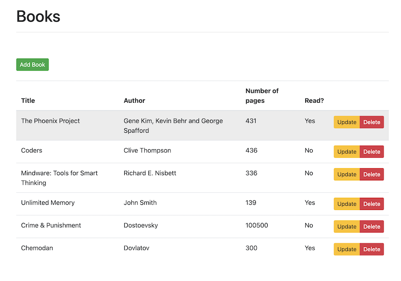

## Lab 6 - Client with vuejs

In this lab we will look into client side part.

To host our client's part (vue.js) we want to use [Static Web Apps](https://azure.microsoft.com/en-us/services/app-service/static/#overview). Static Site Web Application resource has been provisioned as part of the main deployment, let's review it's template.

Review module `staticsite.bicep`:

```bicep

param staticSiteName string
param location string
param tags object
@secure()
param repositoryToken string
param repositoryUrl string
param branch string

resource staticSite 'Microsoft.Web/staticSites@2021-03-01' = {
  name: staticSiteName
  location: location
  tags: tags
  sku: {
    name: 'free'
    tier: 'free'
  }
  properties: {
    repositoryUrl: repositoryUrl
    branch: branch
    stagingEnvironmentPolicy: 'Enabled'
    allowConfigFileUpdates: true
    provider: 'GitHub'
    enterpriseGradeCdnStatus: 'Disabled'
    repositoryToken: repositoryToken
    buildProperties: {
      appLocation: 'client'
      appArtifactLocation: 'dist'
    }
  }
}

```

`staticSites` is a special type of resource that provisions service to run [static site](https://erudinsky.com/2022/01/07/static-web-site-on-azure-with-azure-devops-and-bicep/). To learn more about Static Site resource and it's available parameters visit [template reference](https://docs.microsoft.com/en-us/azure/templates/microsoft.web/staticsites?tabs=bicep).

## Task 6.1: Add changes to static site

Main dependencies:

* [Vuejs](https://vuejs.org/) 
* [Vue CLI](https://cli.vuejs.org/)

```bash 

6-client
├── babel.config.js
├── dist
├── node_modules
├── package-lock.json
├── package.json
├── public
├── src
    ├── App.vue
    ├── assets
    │   └── logo.png
    ├── components
    │   ├── Alert.vue
    │   ├── Books.vue <====== this needs change
    │   ├── HelloWorld.vue
    │   └── Ping.vue <====== this needs change
    ├── main.js
    └── router
        └── index.js
└── vue.config.js <====== this needs change

npm run serve # to test application

```

Make sure to change baseURL in the files marked above with `this needs change`. Use your backend URL (the same the we used with postman in [Lab 5](5-Server-side.md). You can also test client app locally first and if everything works (check your client app via browser to see similar as below image) commit changes and push to git.

If everything went well you should be able to see the following.



In GitHub in [Lab 4](4-Prepare-database.md) we deployed Static App that created workflow that runs everytime when there is change in git. The workflow was created from template by Azure Static Site service and can be found under `./.github/workflows/azure-static-web-apps-random-string.yml`

## Resources

* [vuejs getting started](https://v1.vuejs.org/guide/)
* [Template reference (Static Web)](https://docs.microsoft.com/en-us/azure/templates/microsoft.web/staticsites?tabs=bicep)

Move to the next [task - DevOps](6-DevOps.md).