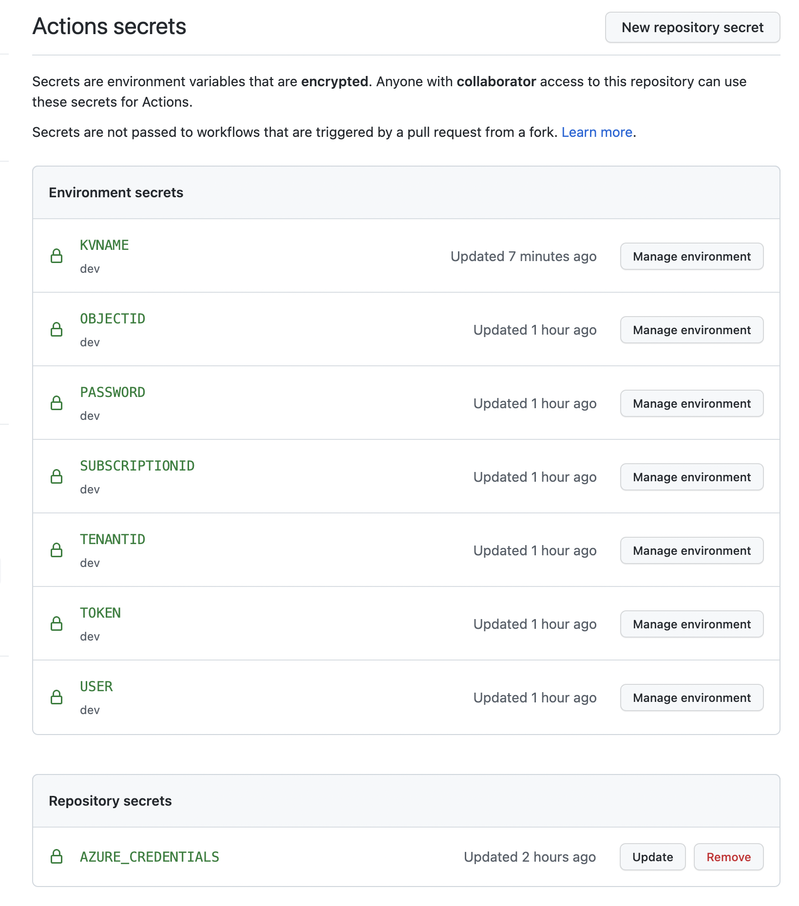

## Lab 7 - DevOps

In this lab we will look into DevOps.


> [What is DevOps?](https://resources.github.com/devops/)

## Task 7.1: Create service principal

Up until now we were using personal account for deployment. Let's first generate [Service Principal](https://docs.microsoft.com/en-us/azure/active-directory/develop/app-objects-and-service-principals#service-principal-object) and build our automation.

You can use portal and follow this tutorial, otherwise just drop the following into your CLI in order to generate SPN and assign contributor on Subscription.

```bash 

# Generate SPN using az cli (replace subscriptionId with your value)
# We decided to use `owner` role since we need role assignment permissions for managed identity

az ad sp create-for-rbac --name AzureBicepWorkshopSPN --role owner --scopes /subscriptions/
<subscriptionId> --sdk-auth

{
  "clientId": "<REDACTED>",
  "displayName": "<REDACTED>",
  "subscriptionId": "<REDACTED>",
  "tenantId": "<REDACTED>",
  "activeDirectoryEndpointUrl": "https://login.microsoftonline.com",
  "resourceManagerEndpointUrl": "https://management.azure.com/",
  "activeDirectoryGraphResourceId": "https://graph.windows.net/",
  "sqlManagementEndpointUrl": "https://management.core.windows.net:8443/",
  "galleryEndpointUrl": "https://gallery.azure.com/",
  "managementEndpointUrl": "https://management.core.windows.net/"
}

```

## Lab 7.2: Create workflow

For our automation we will use GitHub. Navigate to your forked repository and start configuration, go ahead and add the following file and paste the following content `.github/workflows/azure-bicep-workshop.yml`:

> To better learn action's syntax review [this doc](https://docs.github.com/en/actions/learn-github-actions/understanding-github-actions)

```yaml

on: [push]
name: azure-bicep-workshop

jobs:
  build-and-deploy:
    runs-on: ubuntu-latest
    environment: dev
    env:
      ResourceGroupName: azure-bicep-workshop
      ResourceGroupLocation: westeurope
    steps:
    - uses: actions/checkout@master
    - uses: azure/login@v1
      with:
        creds: ${{ secrets.AZURE_CREDENTIALS }}
    - uses: Azure/CLI@v1
      with:
        inlineScript: |
          #!/bin/bash
          az group create --name ${{ env.ResourceGroupName }} --location ${{ env.ResourceGroupLocation }}
          echo "Azure resource group created"

```

Also navigate to GitHub > Settings > Secrets and add new secret `AZURE_CREDENTIALS` and paste output from SPN (json with credentials). This is simple action that uses special tasks and does login and creation of RG. Commit changes and run the action.

A typical cycle for IAC templates would be the following:

- [ARMTTK](https://docs.microsoft.com/en-us/azure/azure-resource-manager/templates/test-toolkit) or [checkov](https://www.checkov.io/) checks
- Then generate immutable artifact
- Deploy to different environment (either automatically or with some additional chesk, quality gates and manual approvals)

We will use simplified process and deploy from agent our templates using Az CLI.

For that, let's create additional file in `.github/workflows`

```yaml

on: [push]
name: azure-bicep-workshop

jobs:
  deploy-initial-resources:
    runs-on: ubuntu-latest
    environment: dev
    env:
      ResourceGroupName: azure-bicep-workshop
      ResourceGroupLocation: westeurope
    steps:
    - uses: actions/checkout@master
    - uses: azure/login@v1
      with:
        creds: ${{ secrets.AZURE_CREDENTIALS }}
    - uses: Azure/CLI@v1
      with:
        inlineScript: |
          #!/bin/bash

          az deployment sub validate \
            --location ${{ env.ResourceGroupLocation }} \
            -f ./templates/main.init.bicep \
            -p ./templates/parameters.init.gh.json \
            -p tenantId=${{ secrets.TENANTID }} \
            objectId=${{ secrets.OBJECTID }} \
            subscriptionId=${{ secrets.SUBSCRIPTIONID }} \
            dbuser=${{ secrets.USER }} \
            dbpassword=${{ secrets.PASSWORD }} \
            token=${{ secrets.TOKEN }}

            

          az deployment sub what-if \
              --location ${{ env.ResourceGroupLocation }} \
              -f ./templates/main.init.bicep \
              -p ./templates/parameters.init.gh.json \
              -p tenantId=${{ secrets.TENANTID }} \
              objectId=${{ secrets.OBJECTID }} \
              subscriptionId=${{ secrets.SUBSCRIPTIONID }} \
              dbuser=${{ secrets.USER }} \
              dbpassword=${{ secrets.PASSWORD }} \
              token=${{ secrets.TOKEN }} \
              --location ${{ env.ResourceGroupLocation }}


          az deployment sub create \
              --location ${{ env.ResourceGroupLocation }} \
              -f ./templates/main.init.bicep \
              -p ./templates/parameters.init.gh.json \
              -p tenantId=${{ secrets.TENANTID }} \
              objectId=${{ secrets.OBJECTID }} \
              subscriptionId=${{ secrets.SUBSCRIPTIONID }} \
              dbuser=${{ secrets.USER }} \
              dbpassword=${{ secrets.PASSWORD }} \
              token=${{ secrets.TOKEN }} \
              --location ${{ env.ResourceGroupLocation }}

  deploy-all-resources:
    runs-on: ubuntu-latest
    environment: dev
    env:
      ResourceGroupName: azure-bicep-workshop
      ResourceGroupLocation: westeurope
    steps:
    - uses: actions/checkout@master
    - uses: azure/login@v1
      with:
        creds: ${{ secrets.AZURE_CREDENTIALS }}
                    
    - uses: Azure/CLI@v1
      with:
        inlineScript: |
          #!/bin/bash

          az deployment group validate \
            -g azure-bicep-workshop \
            -f ./templates/main.bicep \
            -p ./templates/parameters.gh.json \
            -p keyVaultName=${{ secrets.KVNAME }}

          az deployment group what-if \
              -g azure-bicep-workshop \
              -f ./templates/main.bicep \
              -p ./templates/parameters.gh.json \
            -p keyVaultName=${{ secrets.KVNAME }}

          az deployment group create \
              -g azure-bicep-workshop \
              -f ./templates/main.bicep \
              -p ./templates/parameters.gh.json \
              -p keyVaultName=${{ secrets.KVNAME }}

```

Also make sure to add the following secrets to your repo:



Next lab - [clean up](8-Clean-up.md).