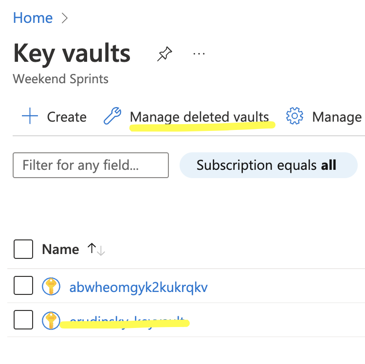

## Clean up

To avoid Azure charges let's clean up. 

1. Remove RG
   
```bash

az group delete -g azure-bicep-workshop -y

```

2. Deleted (purge) Key Vault:



3. Remove custom roles and role assignments
4. Remove assignment of service principal (and service principal itself) that was used in DevOps part.


## Resources

[az cli](https://docs.microsoft.com/en-us/cli/azure/group?view=azure-cli-lates)